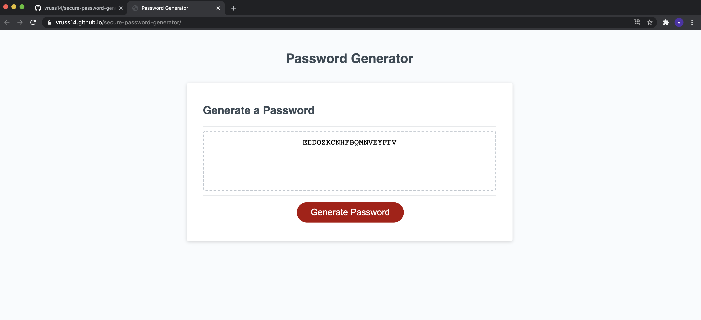
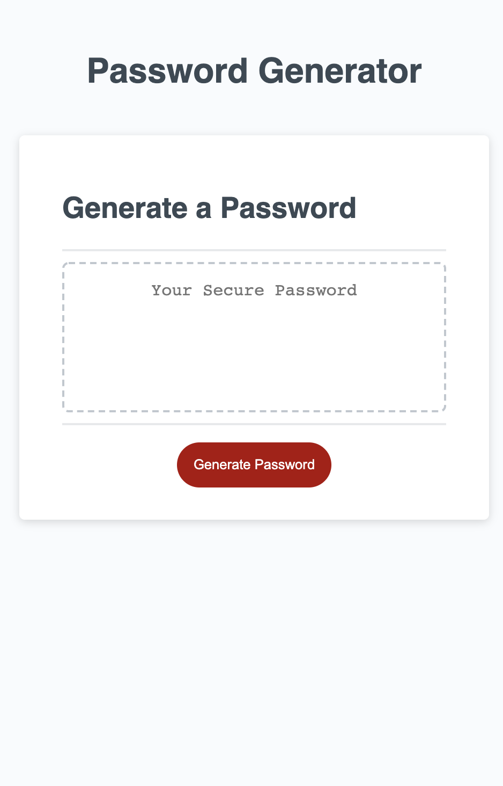

# Secure Password Generator

## Overview

This application utilizes user input to generate a secure, customized password that can fit the needs of any other website requirements.

## Description

The purpose of this project was to design a password generator that took a user's input into consideration. A user can whether he or she would like to include lowercase letters, uppercase letters, numbers, and/or special characters in their password. The user can also choose the password's length, within an acceptable range.

While I initially considered every possible option that could result from a user answering these four questions, I realized there was an easier and more efficient way to write the code. I began with a blank user's array that gets added to, or not added to, with each question. The user's input is then utilized within the final calculation to generate the password.

I ran into several difficulties when creating this project. Finding an efficient approach was my first issue, since I was initially so focused on the 16 possible options that could happen when a user answered all of the initial questions. Creating a userChoice array and adding to it later on was a great solution for this issue.

For a while, I had an issue of the computer remembering the user's first input, even if it was invalid, and not recognizing correct inputs later on. I solved this by separating the questions from the calculation, and ensuring that these questions would be validated before proceeding to the final calculation. If a user makes an error, he or she is notified about the error. If the user fails to select any type of characters for the password, the function ends. If the user fails to input a password length within an acceptable range, the user is asked all the prompts of the function again before moving forward. This ensures that the final calcuation only takes correct user input into consideration when generating the password.

I also ran into an issue with local scope. I then declared variables within the generatePassword rather than the getOptions function, which resolved this issue. 

I learned that the join method is very helpful in the context of arrays, because it removes the commas between characters. Otherwise, the password will not render properly for the user. 

Overall, although I came across many issues I was previously unfamiliar with, I learned a lot by completing the project and am proud of the result. Errors made by the user do not impact the quality of the password generated, and all errors have been taken into consideration.

Please find the deployed application here: https://vruss14.github.io/secure-password-generator/

## Technologies Used

- HTML
- CSS
- JavaScript

## Installation

No installation steps are required to view this project. To view the front-end application, visit the URL above. The application's source code can be found on GitHub here: https://github.com/vruss14/secure-password-generator.

## Usage

This web application is designed for all applications.

Below is a screenshot of the deployed application:

Below is a screenshot of the deployed application on mobile:

## Credits

HTML and CSS source code was provided by the MSU Coding Bootcamp: https://bootcamp.msu.edu/. Valerie Russell created the JavaScript for the application's functionality, and wishes to thank the learning assistant team on Bootcamp Spot for their valuable insights to her questions. Contact Valerie at vruss14@gmail.com.

